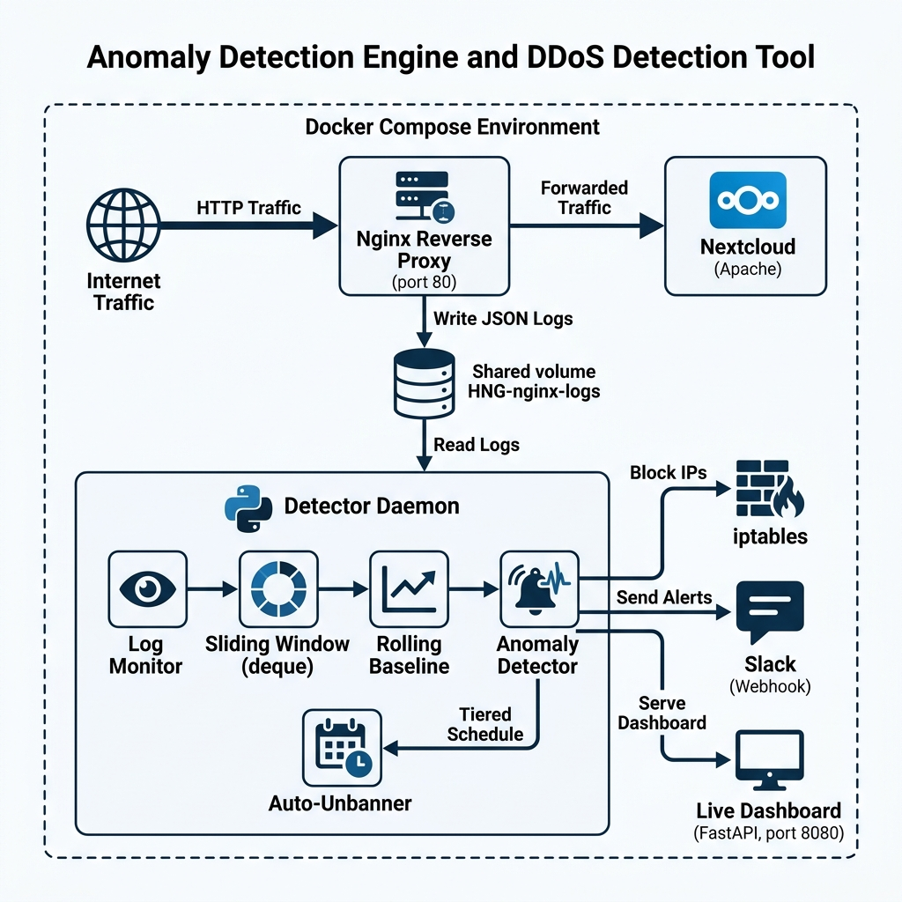

# How I Built a Real-Time DDoS Detection Engine for a Cloud Platform

## Introduction

As a DevSecOps Engineer at a fast-growing cloud storage company powered by Nextcloud, I was tasked with building a real-time anomaly detection engine after a wave of suspicious activity hit our infrastructure. The system needed to monitor live HTTP traffic, learn what "normal" looks like, detect spikes that deviate from the baseline, and automatically block offending IPs — all without using any third-party rate-limiting libraries.

In this post, I'll walk through how I designed and built the system from scratch using Python, Docker Compose, iptables, and a little bit of math.

---

## The Architecture

The system runs as a Docker Compose stack with three services:

1. **Nextcloud** (`kefaslungu/hng-nextcloud`) — the cloud storage platform users interact with.
2. **Nginx** — a reverse proxy that sits in front of Nextcloud, writing every request as a JSON-formatted access log to a shared Docker volume (`HNG-nginx-logs`).
3. **Detector Daemon** — a custom Python service that reads the logs in real time, computes traffic baselines, detects anomalies, blocks IPs via `iptables`, sends Slack alerts, and serves a live metrics dashboard.



The key design decision was keeping the detector on the **host network** (`network_mode: host`) so it has direct access to `iptables` for blocking traffic at the kernel level. This means bans take effect instantly — no proxy-level filtering needed.

---

## How the Sliding Window Works

The core of the detection engine is two `collections.deque` instances that implement a **60-second sliding window**:

- **Global window**: tracks timestamps of ALL incoming requests.
- **Per-IP windows**: a `dict[str, deque]` mapping each source IP to its own timestamp deque.

On every log line:

```python
global_window.append(now)
while global_window[0] < now - 60:
    global_window.popleft()
rate = len(global_window) / 60
```

This gives us O(1) amortized operations — each timestamp is appended once and popped once. No sorting, no copying, no external libraries.

---

## The Rolling Baseline

Knowing the *current* request rate isn't enough. We need to know what "normal" looks like. The baseline manager maintains a **30-minute rolling window** that recalculates every 60 seconds:

| Parameter | Value |
|-----------|-------|
| Window size | 30 minutes |
| Recalculation interval | 60 seconds |
| Per-hour slots | Yes (time-of-day awareness) |
| Floor values | mean ≥ 1.0 req/s, stddev ≥ 0.5 |

The floor values are critical — without them, a server with zero traffic would have a mean of 0 and stddev of 0, making *any* request an "anomaly." The floor ensures the system doesn't panic over legitimate early traffic.

---

## Anomaly Detection Logic

An IP gets flagged if **either** of these conditions fires:

1. **Z-score > 3.0**: `(rate - mean) / stddev > 3.0`
2. **Rate multiplier > 5×**: `rate > 5 × mean`

There's also an **error surge** mechanism: if an IP's 4xx/5xx error rate exceeds 3× the baseline error rate, thresholds are tightened (z-score drops to 1.5, multiplier to 2×). This catches low-rate but high-error attackers like credential stuffers.

---

## Blocking and Auto-Unban

When an IP is flagged, the daemon:
1. Adds a `DROP` rule to the `DOCKER-USER` iptables chain.
2. Sends a Slack alert within 10 seconds containing the IP, condition, rate, baseline, and ban duration.
3. Logs the action to an audit file.

The auto-unban follows a **tiered backoff schedule**:

| Offense | Ban Duration |
|---------|-------------|
| 1st | 10 minutes |
| 2nd | 30 minutes |
| 3rd | 2 hours |
| 4th+ | Permanent |

If the IP behaves after unbanning, an "IP UNBANNED" Slack notification is sent.

---

## The Live Dashboard

The detector serves a FastAPI-based dashboard on port 8080 that auto-refreshes every 3 seconds. It shows:

- Global request rate (req/s)
- Total requests processed
- Number of currently banned IPs (with countdown timers)
- Effective mean and standard deviation from the baseline
- Top 10 source IPs ranked by request rate
- CPU and memory usage
- Engine uptime

The dashboard is served at `zamistage3.duckdns.org` via an Nginx reverse proxy, while Nextcloud is accessed directly by the server's IP.

---

## Testing It

I used Apache Benchmark to simulate a DDoS attack:

```bash
ab -n 500 -c 50 http://localhost/
```

Within seconds, the detector:
1. Flagged a global rate anomaly (`zscore=3.03 > 3.0`)
2. Banned the source IP with an `iptables DROP` rule
3. Sent a Slack alert with full context
4. Displayed the ban on the live dashboard

After 10 minutes, the auto-unbanner lifted the ban and sent a confirmation to Slack.

---

## Lessons Learned

1. **Podman ≠ Docker** — My Oracle Cloud VPS shipped with Podman, which emulates Docker but has broken CNI networking. I spent hours debugging `CNI network not found` errors before manually creating the CNI config files.

2. **Dynamic IPs in containers** — Podman doesn't have DNS resolution on its default bridge network. I had to use a startup script that discovers the Nextcloud container's IP at boot and patches the Nginx config.

3. **Floor values matter** — Without minimum values for the baseline mean (1.0) and stddev (0.5), the system would flag any traffic on a quiet server as anomalous.

4. **GitHub secret scanning** — GitHub blocked my push because my `config.yaml` contained a Slack webhook URL. I had to use a placeholder and inject the real URL at deploy time.

---

## Tech Stack

- **Language**: Python 3.11
- **Web Framework**: FastAPI (dashboard)
- **Containers**: Docker Compose (via Podman)
- **Reverse Proxy**: Nginx (JSON access logs)
- **Blocking**: iptables (DOCKER-USER chain)
- **Alerts**: Slack Webhooks
- **Data Structures**: `collections.deque` for O(1) sliding windows

---

## Links

- **GitHub**: [github.com/Rexien/anomalydetection](https://github.com/Rexien/anomalydetection)
- **Dashboard**: [zamistage3.duckdns.org](http://zamistage3.duckdns.org)
- **Nextcloud**: [92.4.137.99](http://92.4.137.99)
